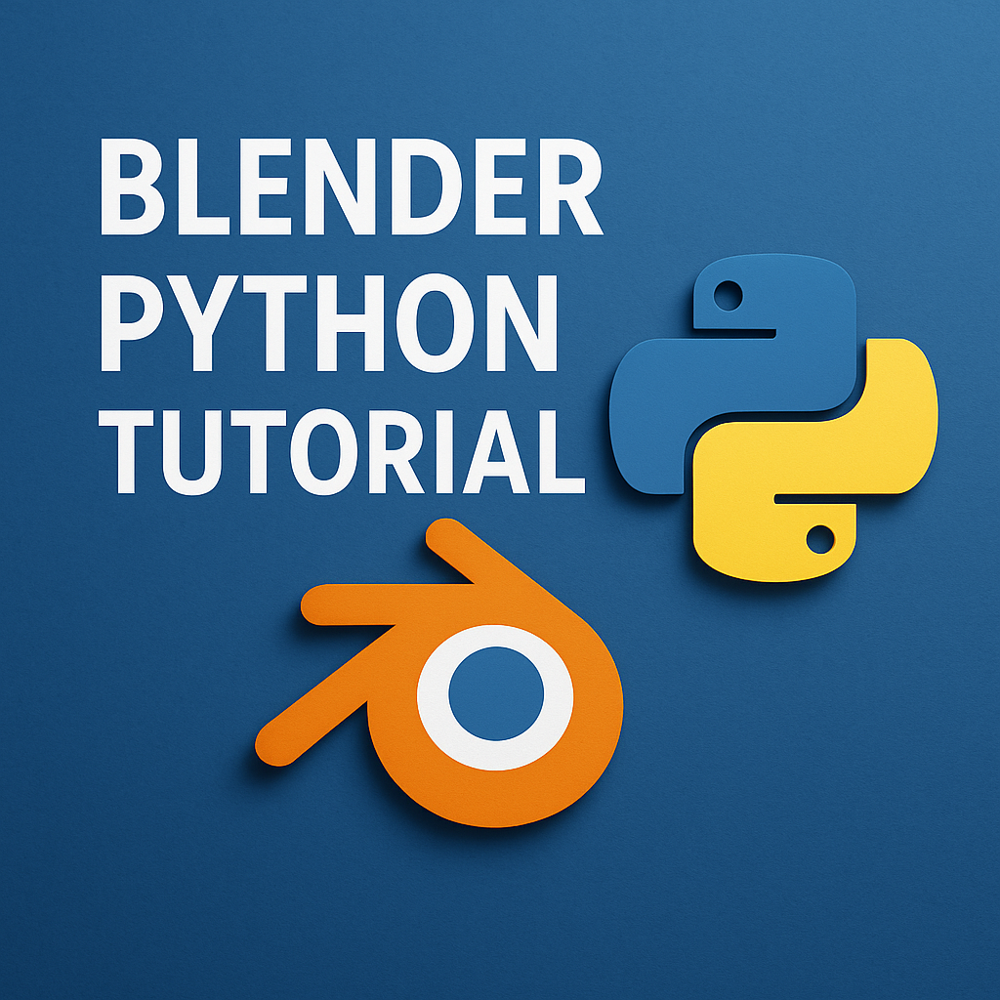

# Blender Python Tutorial

<p align="center">
  
</p>

This repository offers a structured introduction to scripting in Blender using Python. 

It covers essential topics such as object manipulation, material and texture creation, camera control, rendering, and procedural generation. 

The content is suitable for beginners and those looking to automate tasks within Blender.


## Repository Structure

- **`00_find_object.py`**  
  Demonstrates how to locate and reference objects within a Blender scene using Python scripting.

- **`01_context.py`**  
  Explores Blender's context system, illustrating how to access and modify the current state and environment of the Blender interface through scripts.

- **`02_create_object.py`**  
  Provides examples of creating new objects (e.g., meshes) programmatically and adding them to the scene.

- **`03_create_material_texture.py`**  
  Shows how to create materials and apply textures to objects using Python, enabling dynamic material assignment.

- **`04_render_camera_manipulation.py`**  
  Covers techniques for controlling the camera's position and orientation, as well as rendering scenes through scripting.

- **`05_procedural_generation.py`**  
  Introduces procedural content generation, allowing for the creation of complex scenes or objects algorithmically.


- **`06_server_integration/`**  
    Scripts to download and spawn both 3D model and texture from a flask server.

- **`07_add-on/`**  
  Contains Script for Blender add-ons developed during the tutorial.

## Change Absolute dir in scripts for saving and reading

Change all the 

```curr_dir = "C:/Users/Chiqu/Desktop/BLENDER SCRIPTING/Blender-Python-Tutorial/"```

with your absolute path!
 

## Set-up VS code Environment 

Extension can be found [here](https://marketplace.visualstudio.com/items?itemName=JacquesLucke.blender-development).

- 1 CTRL + SHIFT + P while being on the actual python script (Blender must be open)
- 2 Select Blender: Start
- 3 Select You open Blender Version --> This will start a new Blender session on Windows
- 4 Select the Blender Scene you want to apply the script
- 5 Return on VSCODE and again CTRL + SHIFT + P
- 6 Select Blender: Run Script

